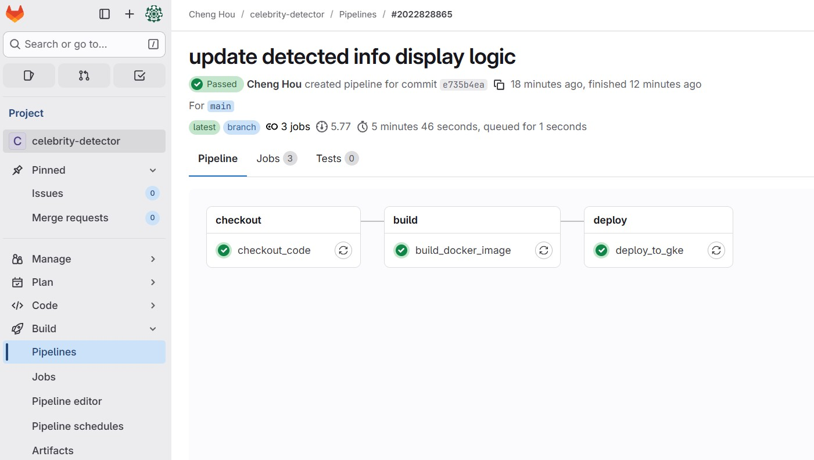
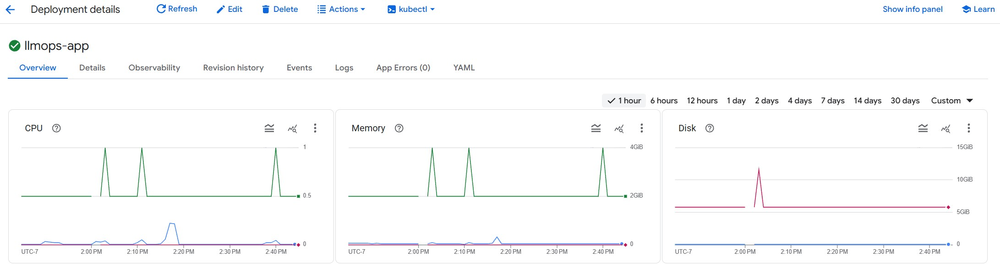

# 1. Project Introduction
Upload an image and discover celebrities with AI-powered recognition and interactive Q&A.

**Demo:**


**CI/CD Pipeline:**



**GKE Deployment Dashboard:**



- **Tech stack**

    - Groq --> LLM
    - Gitlab --> Serve as SCM for the project. Also a CI/CD tool for making pipelines
    - OpenCV Python --> To deal with image work like conversion of images, scaling, etc
    - Flask --> Application backend
    - HTML/CSS --> To make UI or frontend of the app
    - Docker --> For containerization of the app during deployment
    - GCP GAR --> For storing the Docker images
    - GCP GKE --> To deploy and run the app on the cloud within a Kubernetes Cluster. It's a service offered by Google Cloud

- **Workflow**


# 2. Configure VM Instance

### ✅ Pre-Deployment Checklist

Check that you have done the following before moving to the CircleCI deployment part:

1. ✅ Dockerfile  
2. ✅ Kubernetes Deployment file  
3. ✅ Code Versioning using GitLab

### 🚀 GitLab Project Setup and Code Versioning

Make an account on [GitLab](https://gitlab.com), then create a **public project** and follow all necessary steps mentioned in the course video.

Now, perform **code versioning** using GitLab by running the following commands:

```bash
git init
git branch -M main
git remote add origin https://gitlab.com/your-username/your-repo.git
git add .
git commit -m "Initial commit"
git push origin main

```

### ✅ Enable Required GCP APIs

Go to your GCP account and enable all the following APIs:

**Navigation:**  
In the left pane → **APIs & Services** → **Library**

Enable the following:

- Kubernetes Engine API  
- Container Registry API  
- Compute Engine API  
- Cloud Build API  
- Cloud Storage API  
- IAM API


### ✅ Create GKE Cluster and Artifact Registry

1. **Create GKE Cluster:**
   - Go to your GCP Console and search for **GKE**.
   - Create a new cluster with a name of your choice.
   - In the **Networking** tab, provide the necessary access/configurations.

2. **Create Artifact Registry:**
   - In the GCP Console, search for **Artifact Registry**.
   - Create a new Artifact Registry with a name of your choice.


### ✅ Create a Service Account and Configure Access

1. **Create a Service Account** in your GCP Console.

2. **Assign the following roles:**
   - Storage Object Admin  
   - Storage Object Viewer  
   - Owner  
   - Artifact Registry Admin  
   - Artifact Registry Writer  

3. **Download the key** as a `.json` file.

4. **Place the key file** (e.g., `gcp-key.json`) in the **root directory** of your project.

5. **Important:** Add `gcp-key.json` to your `.gitignore` to prevent it from being pushed to GitHub.


### 🔐 Add `gcp-key.json` as a GitLab CI/CD Secret Variable

1. Go to your **GitLab project** → **Settings** → **CI/CD** → expand the **Variables** section.

2. Click **Add Variable** with the following details:

- **Key:** `GCP_SA_KEY`  
- **Value:**  
  Run the following command in your terminal to get the base64 value of your `gcp-key.json` file:

  ```bash
  cat gcp-key.json | base64 -w 0
  ```

### ✅ Set Up LLMOps Secrets in GKE using kubectl

1. **Access your GKE cluster:**
   - Open your GKE Console.
   - Open the **kubectl terminal**.

2. **Configure your local terminal to connect with your cluster:**

   Run the following command, adjusting for your project details:

   ```bash
   gcloud container clusters get-credentials llmops-cluster1 \
   --region us-central1 \
   --project <your project name>
   ```

3. **Create a Kubernetes secret to store your LLM API key:**

   ```bash
   kubectl create secret generic llmops-secrets \
   --from-literal=GROQ_API_KEY="your_actual_groq_api_key"
   ```

   > This secret will be referenced in your Kubernetes deployment file to securely fetch the `GROQ_API_KEY`.


### ⚙️ Set Up GitLab CI/CD with `.gitlab-ci.yml`

Create a `.gitlab-ci.yml` file in the root of your project directory.

✅ GitLab CI/CD setup complete.

Now Push code to Gitlab ---> Automatically triggers the pipeline or u can manually trigger it using

 - Go to Left pane of Gitlab
 - Go to Build --> Pipelines
 - Trigger pipeline from there

* Note:
Your first pipeline might fail if it is  your first time in GitLab because u need to verify your account using phone number or credit card
Do verify and again trigger the pipeline...

- Now go see ur app on GKE Workloads...